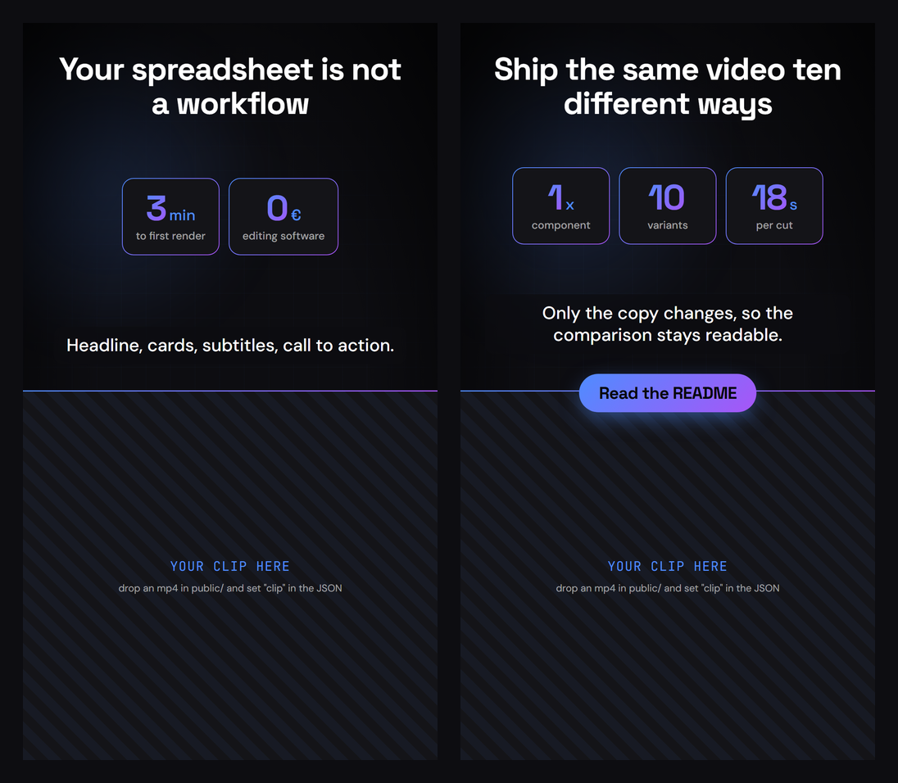
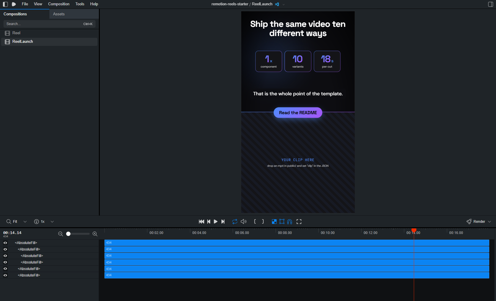

# Remotion Reels Starter

**Automated Short-Video Reel Template for Remotion.** A data-driven 9:16
composition for TikTok, Instagram Reels, YouTube Shorts and Facebook Reels:
one React component, one JSON file per video.

[English](#english) · [Français](#français)



<sub>The two example reels, rendered as shipped. No media required — the lower
band falls back to a placeholder until you point it at a clip.</sub>

---

## English

### What this is

A minimal Remotion project for the format most short-video accounts converge on:
a **50/50 split screen**, overlay on top, footage underneath.

```
0    – 960px    headline, stat cards, subtitles
960  – 1920px   your clip, cropped to cover the band
```

Each video is a JSON file. The component reads it. Adding a variant means adding
a file and one line — no new component, no duplicated scene, no copy-pasted
timing.

Nothing here is tied to a particular voice, avatar or video provider. The clip is
whatever MP4 you drop in `public/`; if there is none, the composition renders a
placeholder so a clean checkout works immediately.

### Requirements

- Node 18 or newer
- No other tooling. Remotion ships its own ffmpeg, and there is no Tailwind, no
  CSS framework and no build step beyond Remotion itself. Styling is plain inline
  styles reading tokens from `src/theme.ts`.

### Install, preview, render

```bash
npm install     # install dependencies
npm start       # open Remotion Studio at http://localhost:3000
npm run build   # render to out/reel.mp4
```



`npm start` gives you the composition list on the left, the live preview in the
middle and a frame-accurate timeline underneath. Every reel declared in
`data/reels.ts` shows up there automatically.

`npm run build` renders the `Reel` composition. To render another one:

```bash
npx remotion render ReelLaunch out/launch.mp4 --codec=h264 --crf=16 --concurrency=50%
```

Run `npm run typecheck` before committing; there is no linter in this project on
purpose.

### Adding a reel

Two edits.

**1. A JSON file in `data/`:**

```json
{
  "id": "ReelPricing",
  "fps": 30,
  "width": 1080,
  "height": 1920,
  "durationInFrames": 450,
  "headline": "Your hook, on frame one",
  "stats": [
    { "value": "5", "unit": "min", "label": "setup" }
  ],
  "subtitles": [
    "First spoken segment.",
    "Second spoken segment."
  ],
  "cta": "Comment AUDIT",
  "clip": null
}
```

**2. One line in `data/reels.ts`:**

```ts
export const REELS = {
  example: example as ReelConfig,
  launch: launch as ReelConfig,
  pricing: pricing as ReelConfig,   // <- here
} satisfies Record<string, ReelConfig>;
```

`Root.tsx` walks `REELS` and registers a composition for each entry, so there is
no third place to keep in sync. The `id` field is the composition name you pass
to `remotion render`.

### Using your own footage

Drop an MP4 in `public/`, then point the reel at it:

```json
"clip": { "file": "avatar.mp4", "width": 1080, "height": 1920, "crop": null }
```

`crop` is for letterboxed sources. Talking-head generators commonly return a clip
that honours the requested aspect ratio by padding the real footage with flat
colour — invisible on a white page, obvious over a dark composition. Measure the
first and last non-uniform row of the source once and put them in `crop`, and the
band will frame the useful area instead of the padding.

### Usage tips

**Content and colour live in two different files, on purpose.** A reel JSON such
as `data/launch.json` carries only what changes from one video to the next —
copy, numbers, duration, footage. The palette is shared by every reel, so it sits
in `src/theme.ts`. Editing one never breaks the other.

To recolour the whole template, change two values:

```ts
// src/theme.ts
export const COLORS = {
  accent: '#4f8cff',      // card borders, big numbers, orb 1, CTA gradient start
  secondary: '#a855f7',   // orb 2, CTA gradient end, gradient text
  bg: '#0d0d11',          // canvas
  card: '#141418',        // card fill, placeholder band
  text: '#ffffff',
  textMuted: 'rgba(255,255,255,0.62)',
} as const;
```

Nothing downstream hardcodes a colour, so the stat card borders, the gradient
numbers, the CTA pill, the seam between the two halves and the two background
orbs all follow. Keep `bg` and `card` close in luminance — the cards should read
as raised, not as boxes.

To change what a reel says, edit its JSON:

```jsonc
// data/launch.json
{
  "headline": "Your hook, on frame one",   // top of the frame, visible at 0:00
  "stats": [ { "value": "10", "unit": "x", "label": "faster" } ],
  "subtitles": [ "First segment.", "Second segment." ],
  "cta": "Read the README",
  "durationInFrames": 540                  // 18s at 30fps
}
```

Two things to keep in mind while editing:

- **Subtitle segments are timed by character count**, so a very short segment
  gets a very short slot. Keep them roughly even, or plug in real timings (see
  `src/timing.ts`).
- **Two or three stat cards fit the width.** A fourth overflows at the current
  font size — drop to two cards, or lower the `fontSize` in `StatCard.tsx`.

Full field reference with an annotated example: [docs/customization.md](docs/customization.md).

### Things worth knowing

These are the parts that cost time to discover.

- **`--concurrency=50%` is not an optimisation.** On Windows, rendering at the
  default concurrency can fail with `FFmpeg 3221225794` (`0xC0000142`, a DLL
  initialisation failure caused by resource exhaustion). Keep the flag. If it
  still happens, drop to `--concurrency=2`, then try `--gl=angle`.
- **Mount `<Background />` outside every `<Sequence>`.** Inside a sequence,
  `useCurrentFrame()` is local to that sequence, so the drifting orbs restart at
  each scene and the reel reads as a series of cuts.
- **`background-clip: text` clips the whole background.** If a node has both a
  `backgroundColor` and the gradient-text helper, the fill disappears with it and
  you get an empty gradient rectangle. Put the fill on the parent.
- **`border-image` ignores `border-radius`.** The gradient-bordered cards are a
  gradient container with `padding: 2` around an opaque child, which is why.
- **Load font weights explicitly.** `loadFont()` with no options may not fetch the
  heavy weights, and the renderer then falls back to a system sans-serif. You
  only see it in the final MP4.
- **The bottom ~384px belong to the platform.** Captions, the follow button and
  the action rail sit there. `UI_SAFE_BOTTOM` in `src/layout.ts` documents it.
  This is why the CTA sits on the seam rather than at the bottom of the frame.
- **Subtitle timing is proportional to character count.** With no per-word
  timings, segments are spread across the duration by length. It holds when
  segments are of comparable size and drifts when one is much shorter. If your
  voice track has real timings, replace `currentSubtitle()` in `src/timing.ts`
  and keep the return shape.

### Rebranding

Everything visual comes from `src/theme.ts`. Change `accent` and `secondary` and
the card borders, gradient text, CTA pill and background orbs all follow. Fonts
are in `src/font.ts`; the defaults are Space Grotesk, DM Sans and JetBrains Mono,
all loaded from Google Fonts by `@remotion/google-fonts`.

### Layout

```
data/
  reels.ts          the registry — one line per reel
  example.json      a reel
  launch.json       another one
public/             your media (git-ignored)
src/
  index.ts          Remotion entry point
  Root.tsx          registers one composition per entry in REELS
  Reel.tsx          the split-screen layout
  theme.ts          colours, gradient, spring config
  font.ts           font loading
  layout.ts         orientation helper, platform-safe area
  timing.ts         subtitle distribution
  components/
    Background.tsx  grid, drifting orbs, vignette
    StatCard.tsx    number card with a gradient border
    Subtitles.tsx   one segment at a time
    CtaPill.tsx     call to action
    VideoBand.tsx   footage, cropped to cover the band
```

### License

MIT. See [LICENSE](LICENSE).

---

## Français

### De quoi il s'agit

Un projet Remotion minimal pour le format vers lequel convergent la plupart des
comptes de vidéo courte : un **split-screen 50/50**, l'habillage en haut, la vidéo
en bas.

```
0    – 960px    titre, cartes de chiffres, sous-titres
960  – 1920px   ton clip, cadré pour couvrir la bande
```

Chaque vidéo est un fichier JSON, lu par le composant. Ajouter une déclinaison
demande un fichier et une ligne : pas de nouveau composant, pas de scène
dupliquée, pas de timing recopié.

Rien n'est lié à un fournisseur de voix, d'avatar ou de vidéo. Le clip est le MP4
que tu déposes dans `public/` ; s'il n'y en a pas, la composition affiche un
gabarit et un dépôt fraîchement cloné se rend tel quel.

### Prérequis

- Node 18 ou plus récent
- Rien d'autre. Remotion embarque son ffmpeg, et il n'y a ni Tailwind, ni
  framework CSS, ni étape de build en dehors de Remotion. Le style tient en
  styles inline qui lisent les jetons de `src/theme.ts`.

### Installer, prévisualiser, rendre

```bash
npm install     # installe les dépendances
npm start       # ouvre Remotion Studio sur http://localhost:3000
npm run build   # rend out/reel.mp4
```


`npm start` affiche la liste des compositions à gauche, la prévisualisation au
centre et une timeline à la frame en dessous. Toute déclinaison déclarée dans
`data/reels.ts` y apparaît automatiquement.

`npm run build` rend la composition `Reel`. Pour une autre :

```bash
npx remotion render ReelLaunch out/launch.mp4 --codec=h264 --crf=16 --concurrency=50%
```

Lance `npm run typecheck` avant de commiter : il n'y a volontairement pas de
linter dans ce projet.

### Ajouter une déclinaison

Deux écritures : un JSON dans `data/` sur le modèle de `example.json`, puis une
ligne dans `REELS` (`data/reels.ts`). `Root.tsx` parcourt cet objet et enregistre
une composition par entrée, il n'y a donc pas de troisième endroit à tenir à
jour. Le champ `id` est le nom de composition à passer à `remotion render`.

### Utiliser ta propre vidéo

Dépose un MP4 dans `public/`, puis pointe la déclinaison dessus :

```json
"clip": { "file": "avatar.mp4", "width": 1080, "height": 1920, "crop": null }
```

`crop` sert aux sources qui arrivent avec des bandes. Les générateurs d'avatars
parlants respectent le ratio demandé en complétant l'image utile par un aplat :
invisible sur une page blanche, flagrant sur une composition sombre. Mesure une
fois la première et la dernière ligne non uniforme de la source, mets-les dans
`crop`, et le cadrage visera l'image utile et non le remplissage.

### Conseils d'usage

**Le contenu et la couleur vivent dans deux fichiers différents, volontairement.**
Un JSON de déclinaison comme `data/launch.json` ne porte que ce qui change d'une
vidéo à l'autre : textes, chiffres, durée, clip. La palette est commune à toutes
les déclinaisons, elle est donc dans `src/theme.ts`. Toucher à l'un ne casse
jamais l'autre.

Pour recolorer tout le template, deux valeurs suffisent :

```ts
// src/theme.ts
export const COLORS = {
  accent: '#4f8cff',      // bordures de cartes, grands chiffres, halo 1, début du dégradé CTA
  secondary: '#a855f7',   // halo 2, fin du dégradé CTA, texte en dégradé
  bg: '#0d0d11',          // fond
  card: '#141418',        // remplissage des cartes et du gabarit
  text: '#ffffff',
  textMuted: 'rgba(255,255,255,0.62)',
} as const;
```

Rien en aval n'écrit une couleur en dur : bordures des cartes, chiffres en
dégradé, pastille de CTA, liseré de la couture et halos de fond suivent tous.
Garde `bg` et `card` proches en luminance, les cartes doivent se lire comme un
relief et non comme des boîtes.

Pour changer ce que dit une déclinaison, édite son JSON :

```jsonc
// data/launch.json
{
  "headline": "Ton accroche, dès la première frame",
  "stats": [ { "value": "10", "unit": "x", "label": "plus vite" } ],
  "subtitles": [ "Premier segment.", "Deuxième segment." ],
  "cta": "Commente AUDIT",
  "durationInFrames": 540                  // 18 s à 30 fps
}
```

Deux points à garder en tête :

- **Les segments de sous-titres sont calés au nombre de caractères**, donc un
  segment très court reçoit une fenêtre très courte. Garde-les de longueur
  comparable, ou branche de vrais timings (voir `src/timing.ts`).
- **Deux ou trois cartes tiennent dans la largeur.** Une quatrième déborde à la
  taille de police actuelle : passe à deux cartes, ou baisse le `fontSize` dans
  `StatCard.tsx`.

Référence complète des champs, avec un exemple commenté :
[docs/customization.md](docs/customization.md).

### Ce qu'il faut savoir

Les points qui coûtent du temps à découvrir.

- **`--concurrency=50%` n'est pas une optimisation.** Sous Windows, le rendu à la
  concurrence par défaut échoue avec `FFmpeg 3221225794` (`0xC0000142`, échec
  d'initialisation de DLL par saturation de ressources). Garde le flag. En cas de
  récidive, descends à `--concurrency=2`, puis essaie `--gl=angle`.
- **Monte `<Background />` hors de toute `<Sequence>`.** Dans une séquence,
  `useCurrentFrame()` est relatif à celle-ci : les halos repartent de zéro à
  chaque scène et la vidéo se lit comme une suite de coupes.
- **`background-clip: text` découpe tout le fond, pas seulement le texte.** Un
  nœud qui cumule `backgroundColor` et le dégradé sur texte perd son fond et sort
  en rectangle dégradé vide. Mets le fond sur le parent.
- **`border-image` ignore `border-radius`.** D'où les cartes à bordure dégradée
  faites d'un conteneur en dégradé avec `padding: 2` autour d'un enfant opaque.
- **Charge les graisses de police explicitement.** `loadFont()` sans options ne
  récupère pas forcément les graisses lourdes, et le rendu retombe alors sur une
  sans-serif système. Ça ne se voit que dans le MP4 final.
- **Les 384 px du bas appartiennent à la plateforme.** Sous-titres, bouton
  d'abonnement et colonne d'actions s'y posent. `UI_SAFE_BOTTOM` dans
  `src/layout.ts` le documente. C'est pour ça que le CTA est sur la couture et
  non en bas du cadre.
- **Le calage des sous-titres est proportionnel au nombre de caractères.** Faute
  de timings par mot, les segments se répartissent selon leur longueur. Correct
  sur des segments comparables, approximatif dès que l'un est beaucoup plus
  court. Si ta piste voix a de vrais timings, remplace `currentSubtitle()` dans
  `src/timing.ts` en gardant la même forme de retour.

### Changer l'identité visuelle

Tout part de `src/theme.ts`. Change `accent` et `secondary` : bordures de cartes,
texte en dégradé, pastille de CTA et halos de fond suivent. Les polices sont dans
`src/font.ts` — par défaut Space Grotesk, DM Sans et JetBrains Mono, chargées
depuis Google Fonts par `@remotion/google-fonts`.

### Licence

MIT. Voir [LICENSE](LICENSE).
